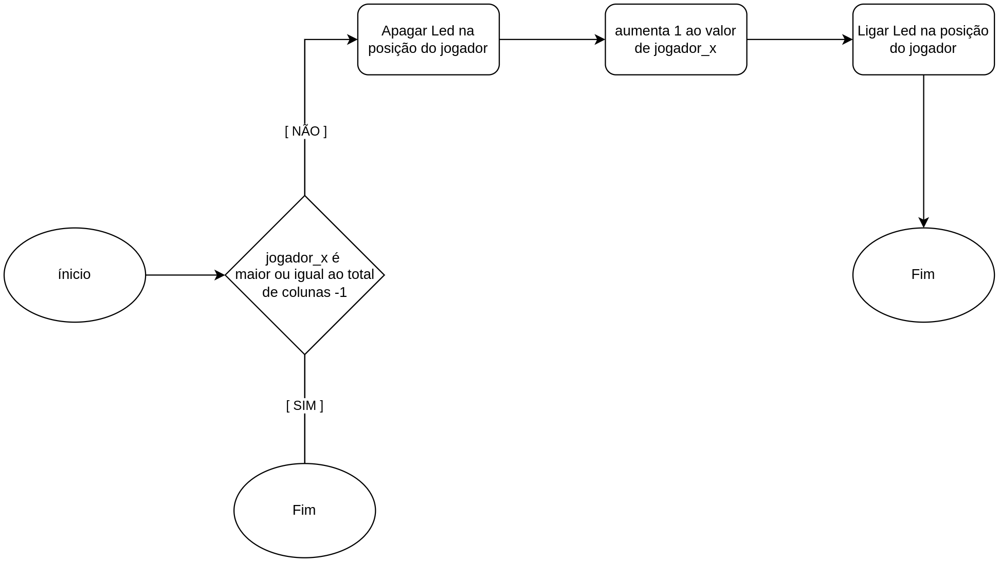
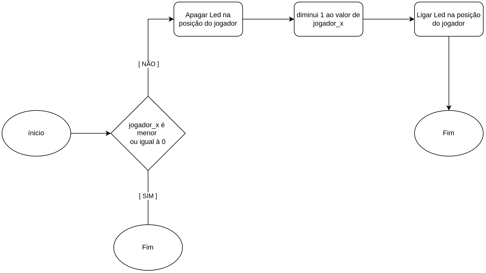
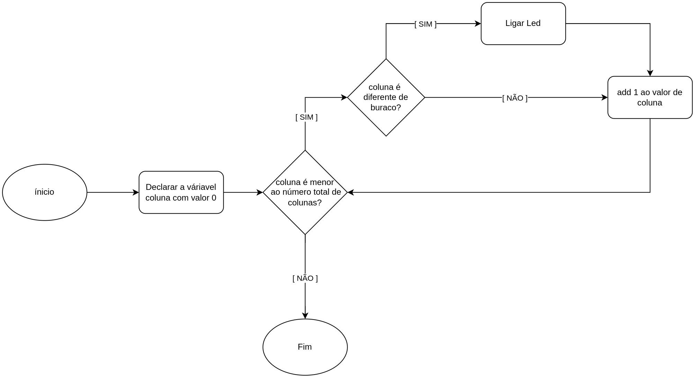
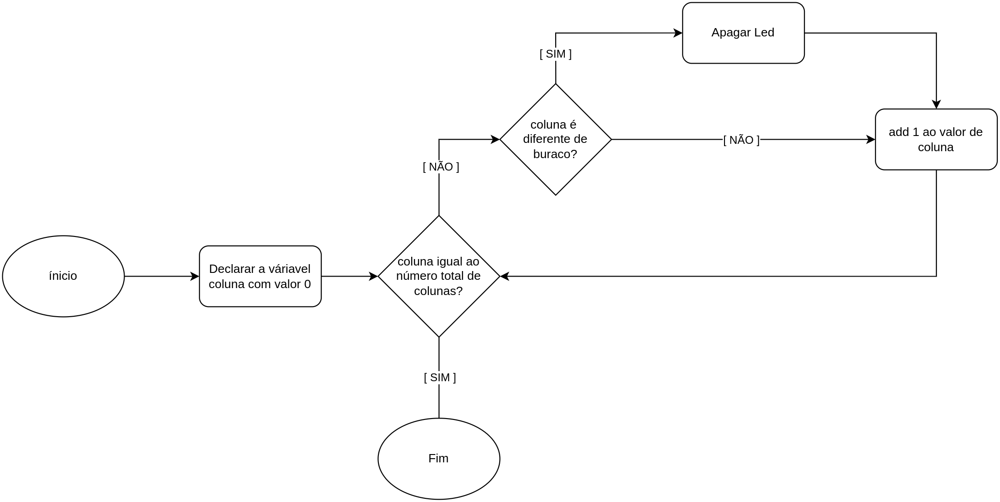

# Básico BitDogLab

- **Botão**: Um interruptor que, quando pressionado, faz algo acontecer, como acender uma luz.
- **Buzzer**: Um pequeno dispositivo que emite som quando ligado, como um alarme.
- **Tela OLED**: Uma tela pequena e fina que pode mostrar textos ou imagens, usada em dispositivos como alguns celulares.
- **LED**: Uma luz pequena que acende quando eletricidade passa por ela, usada para indicar coisas como se um aparelho está ligado.

# Explicação de Programação em Python
## `def`

A palavra `def` é usada para criar uma "função". Pense numa função como uma receita de bolo. Quando você usa `def`, você está escrevendo uma receita que pode ser seguida sempre que precisar.

Exemplo:

```py
def dizer_ola(nome):
    print("Olá, " + nome + "!")
```

Aqui, dizer_ola é a nossa receita. Quando você seguir essa receita e colocar um nome, vai ver a mensagem "Olá, nome!"

## Lógica Booleana

A lógica booleana usa operadores para fazer comparações e decisões. Os operadores principais são:

    Igual a (==): Verifica se dois valores são iguais.
    Não igual a (!=): Verifica se dois valores são diferentes.
    Maior que (>): Verifica se um valor é maior que outro.
    Menor que (<): Verifica se um valor é menor que outro.
    E (and): Verifica se ambas as condições são verdadeiras.
    Ou (or): Verifica se pelo menos uma das condições é verdadeira.
    Não (not): Inverte o valor lógico.

Exemplo:
```py
idade = 10
if idade >= 18:
    print("Você é adulto.")
else:
    print("Você é menor de idade.")
```

### Operadores Lógicos

`and`: O operador `and` retorna `True` se ambas as condições forem verdadeiras. Se qualquer uma das condições for falsa, o resultado será `False`.

Exemplo:
```py
a = 10
b = 20

resultado = (a > 5) and (b < 25)  # Ambas as condições são verdadeiras
print(resultado)  # Imprime True

resultado = (a > 15) and (b < 25)  # A primeira condição é falsa
print(resultado)  # Imprime False
```

`or`: O operador `or` retorna `True` se pelo menos uma das condições for verdadeira. O resultado é `False` apenas se todas as condições forem falsas.

Exemplo:
```py
a = 10
b = 20

resultado = (a > 5) or (b < 15)  # A primeira condição é verdadeira
print(resultado)  # Imprime True

resultado = (a > 15) or (b < 15)  # Ambas as condições são falsas
print(resultado)  # Imprime False
```

`not`: O operador `not` inverte o valor lógico de uma condição. Se a condição for `True`, `not` a torna False, e vice-versa.

Exemplo:
```py
a = 10

resultado = not (a > 5)  # A condição (a > 5) é verdadeira, então not a torna falsa
print(resultado)  # Imprime False

resultado = not (a > 15)  # A condição (a > 15) é falsa, então not a torna verdadeira
print(resultado)  # Imprime True
```

Combinações de `and`, `or`, e `not`

Você pode combinar esses operadores para construir expressões lógicas mais complexas.

Exemplo de combinação:
```py
a = 10
b = 20
c = 5

resultado = (a > 5) and (b < 25) or (c > 10)  # Primeiro, avalia (a > 5) e (b < 25) que são True, então or é True
print(resultado)  # Imprime True

resultado = not ((a > 5) and (b > 25))  # (a > 5) é True, (b > 25) é False, então and é False, not inverte para True
print(resultado)  # Imprime True

resultado = (a > 5) or not (b < 15)  # (a > 5) é True, not (b < 15) é not False, então or é True
print(resultado)  # Imprime True
```

Comparações Comuns

Aqui estão algumas comparações comuns e como os operadores lógicos funcionam com elas:

Verificação de Idade e Licença de Condução:
```py
idade = 17
tem_licenca = False

pode_dirigir = (idade >= 18) and tem_licenca
print(pode_dirigir)  # Imprime False (idade é menor que 18)
```

Verificação de acesso a um site baseado em idade ou assinatura:
```py
idade = 21
assinante = True

acesso = (idade >= 18) or assinante
print(acesso)  # Imprime True (idade é maior ou igual a 18)
```

Verificação se um número não está em um intervalo:
```py
numero = 15

fora_do_intervalo = not (10 <= numero <= 20)
print(fora_do_intervalo)  # Imprime False (número está dentro do intervalo)
```

## `if`

A palavra `if` é usada para fazer decisões. É como quando você pergunta se pode brincar se tiver terminado a lição de casa.

Exemplo:
```py
idade = 10
if idade >= 10:
    print("Você pode entrar no jogo!")
else:
    print("Você é muito jovem para esse jogo.")
```

Aqui, `if` verifica se a idade é maior ou igual a 10. Se for, ele mostra "Você pode entrar no jogo!" caso contrário, ele mostra "Você é muito jovem para esse jogo."

## `while`

A palavra `while` é usada para fazer algo repetidamente enquanto uma condição for verdadeira. É como se você estivesse jogando um jogo e continua jogando enquanto você não perdeu.

Exemplo:
```py
contador = 0
while contador < 5:
    print("Número:", contador)
    contador = contador + 1
```

Aqui, `while` faz o código dentro dele rodar enquanto contador for menor que 5. Então, ele mostra números de 0 a 4.

## Variáveis

Em Python, uma variável é como uma caixa onde você pode guardar um valor. Por exemplo, você pode ter uma variável chamada idade que guarda um número.

Exemplo:
```py
idade = 10
nome = "Ana"
```

## Tipos de Dados

Python tem vários tipos de dados. Aqui estão alguns dos mais comuns:

    Inteiros (int): Números sem ponto decimal. Exemplo: 5
    Flutuantes (float): Números com ponto decimal. Exemplo: 3.14
    Strings (str): Sequências de caracteres. Exemplo: "Olá"
    Booleanos (bool): Representam True (verdadeiro) ou False (falso). Exemplo: True

Exemplo:
```py
idade = 10        # int
altura = 1.75     # float
nome = "Ana"      # str
estudante = True  # bool
```

Para converter de um tipo ao outro existem varias funções como:
### `int`
converte uma `string` (texto) em `int` (inteiro)

Exemplo:
```py
a = "5" # str

# não se pode fazer contas com texto, a linha abaixo da erro
b = a + 4 # errado :(

# para fazer contas precisamos primeiro transformar o texto em número
numero_a = int(a) # transforma o texto "5" em número 5
b = numero_a + 4 # agora podemos fazer contas com o número :)
```

### `str`
converte uma `int` (inteiro) em `string` (texto)

Exemplo:
```py
a = 5 # int

# não se pode salvar números em arquivos de texto
escrever_arquivo(a) # da erro :(

# primeiro precisamos transformar o número em texto
texto_a = str(a) # transforma o número 5 em texto "5"
escrever_arquivo(texto_a) # agora podemos fazer escrever em arquivos :)
```

## Listas

Uma lista é uma coleção de itens que podem ser de diferentes tipos de dados. Você pode acessar, adicionar, e remover itens das listas.

Exemplo:

```py
frutas = ["maçã", "banana", "laranja"]

# Acessando um item
print(frutas[1])  # Imprime 'banana'

# Adicionando um item
frutas.append("uva")

# Removendo um item
frutas.remove("banana")

# Percorrendo a lista
for fruta in frutas:
    print(fruta)
```

## Variáveis Locais vs. Globais

    Variáveis Locais: Definidas dentro de uma função e só podem ser usadas dentro dessa função.
    Variáveis Globais: Definidas fora de qualquer função e podem ser usadas em qualquer lugar no código.

### Usando a Palavra-chave global

Quando você precisa modificar uma variável global dentro de uma função, você deve usar a palavra-chave global para dizer ao Python que está se referindo à variável global, não a uma nova variável local.

Exemplo sem global:
```py

numero = 10  # Variável global

def mudar_numero_para_um():
    numero = 1  # Isso cria uma nova variável local chamada `numero`
    print("Número dentro da função:", numero)

mudar_numero_para_um()
print("Número fora da função:", numero)  # Isso ainda será 10

```

Neste exemplo, numero dentro da função é uma nova variável local, não afeta a variável global numero.

Exemplo com global:
```py

numero = 10  # Variável global

def mudar_numero_para_um():
    global numero  # Diz ao Python que queremos usar a variável global `numero`
    numero = 1  # Modifica a variável global
    print("Número dentro da função:", numero)

mudar_numero_para_um()
print("Número fora da função:", numero)  # Isso será 1

```

Neste exemplo, ao usar global, a função `mudar_numero_para_um` modifica a variável global numero, e a mudança é refletida fora da função também.


# criar o jogador
## ligar o led
```py
from BitDogLib import * # está linha nos da acesso a funções para interagir com o BitDogLab
ligar_led(2, 0, [0,0,1])
```
como vamos mexer bastante o jogador para deixar mais fácil podemos criar variaveis para salvar os dados.

```py
AZUL = [0, 0, 1]
jogador_x = 2
jogador_y = 0
ligar_led(jogador_x, jogador_y, AZUL) 
```

## mover o jogador
para ficar fácil de mover o jogador vamos criar funções.
### mover para a direita

```py
# como vamos usar o número total de colunas varias muitas vezes vamos criar uma variável.
TOTAL_COLUNAS = 5
# função para mover o jogador para a direita
def jogador_direita():
    global jogador_x
    # primeiro verificamos se o jogador não está no canto direito
    if jogador_x >= TOTAL_COLUNAS - 1:
        return
    # apagamos o led da posição atual do jogador
    apagar_led(jogador_x, jogador_y)
    # mudamos a posição para a direita
    jogador_x = jogador_x + 1
    # ligamos o led da nova posição do jogador
    ligar_led(jogador_x,jogador_y, AZUL)
```

### mover para a esquerda

```py
def jogador_esq():
    # declaramos que vamos fazer alterações na variável global
    global jogador_x
    # primeiro verificamos se o jogador não está no canto esquerdo
    if jogador_x <= 0:
        return
    # apagamos o led da posição atual do jogador
    apagar_led(jogador_x, jogador_y)
    # mudamos a posição para a esquerda
    jogador_x = jogador_x - 1
    # ligamos o led da nova posição do jogador
    ligar_led(jogador_x, jogador_y, AZUL)
```
## botão
```py
def jogo(delta):
    # verificamos se o jogador pressionou algum botão
    if botao_A_pressionado():
        # se ele pressionou o botão A movemos para a equerda
        jogador_esq()
    if botao_B_pressionado():
        # se ele pressionou o botão B movemos para a direita
        jogador_direita()

# passamos a função jogo que criamos como variavel da função loop
loop(jogo)
```

# criar árvores
## ligar um led
novamente podemos criar variáveis para salvar os dados que vamos usar muitas vezes.
```py
VERDE = [0, 1, 0]
arvore_x = 0
arvore_y = 4
ligar_led(arvore_x, arvore_y, VERDE)
```
## mover um led
agora que acendemos um led podemos criar a função para movê-lo
```py
def mover_arvore(tempo):
    global arvore_y
    # calculamos a distancia que as arvores vão mover
    # velocidade = distância / tempo
    # então podemos calcular a distância movida em certo tempo fazendo
    # tempo * velocidade = distância
    dist = tempo/250_000
    # apagamos a linha atual
    # usamos a função int para transformar o número quebrado da arvore_y em um inteiro
    apagar_led(arvore_x, arvore_y)
    # calculamos a nova posição da arvore
    # subtraindo a posição atual da distância movida
    arvore_y = arvore_y - dist
    # verificamos se a árvore ainda está no led
    if arvore_y < 0:
        # se a árvore já saiu do led vamos 
        arvore_y = 4
        return
    # se a árvore não saiu dos leds ligamos o led na nova posição
    ligar_led(arvore_x, arvore_y, VERDE)
```
```py
def jogo(delta):
    # passamos o delta que é o tempo desde a última iteração para a nossa nova função
    mover_arvore(delta)

    if botao_A_pressionado():
        jogador_esq()
    if botao_B_pressionado():
        jogador_direita()

loop(jogo)
```
## bug do .999999
Opá, parece que tem algo errado no código a árvore não parece começar na última linha.
Isso acontece porque o código começa com 4 então na primeira iteração ele já vai para baixo de 4 e muda de linha. Podemos resolver isso começando a linha com 4.999999 se usássemos 5 a função retornaria um erro pois o BitDogLab só tem linhas de 0 até 4.
```py
VERDE = [0, 1, 0]
arvore_x = 0
arvore_y = 4.999999
ligar_led(arvore_x, arvore_y, VERDE)
```
```py
def mover_arvore(tempo):
    global arvore_y
    # calculamos a distancia que as arvores vão mover
    # velocidade = distância / tempo
    # então podemos calcular a distância movida em certo tempo fazendo
    # tempo * velocidade = distância
    dist = tempo/250_000
    # apagamos a linha atual
    # usamos a função int para transformar o número quebrado da arvore_y em um inteiro
    apagar_led(arvore_x, arvore_y)
    # calculamos a nova posição da arvore
    # subtraindo a posição atual da distância movida
    arvore_y = arvore_y - dist
    # verificamos se a árvore ainda está no led
    if arvore_y < 0:
        # se a árvore já saiu do led vamos 
        arvore_y = 4.999999
        return
    # se a árvore não saiu dos leds ligamos o led na nova posição
    ligar_led(arvore_x, arvore_y, VERDE)
```

## criar uma linha de leds
não queremos apenas um led de árvore mas uma linha de árvores.
**função ligar_linha:**

```py
# função para ligar uma linha inteira no tela led
def ligar_linha(arvore_y):
    coluna = 0
    while coluna < TOTAL_COLUNAS:
    # usamos um loop para ligar cada led da linha
        ligar_led(coluna, arvore_y, VERDE)
        # aumentamos o i para 
        coluna = coluna + 1
```
Agora podemos ligar uma linha de leds ao invês de apenas um led, lembre-se de colocar a função ligar_linha antes de usa-lá.
```py
VERDE = [0, 1, 0]
arvore_x = 0
arvore_y = 4.999999
# agora aqui também precisamos mudar arvore_y para int
ligar_linha(int(arvore_y))
```
Uma função para apagar os leds também será útil.

```py
# função para desligar uma linha inteira no tela led
def apagar_linha(y):
    coluna = 0
    while coluna < TOTAL_COLUNAS:
    # usamos um loop para desligar cada led da linha
        apagar_led(coluna, y)
        coluna = coluna + 1
```
## mover uma linha de leds
Agora que temos essa funções podemos mudar o nosso código de mover árvore para mover uma linha de árvores ao invês de uma árvore só. Lembre-se de que a ligar_linha e apagar_linha precisam vir antes de mover_arvore.
```py
def mover_arvore(tempo):
    global arvore_y
    # calculamos a distancia que as arvores vão mover
    # velocidade = distância / tempo
    # então podemos calcular a distância movida em certo tempo fazendo
    # tempo * velocidade = distância
    dist = tempo/250_000
    # apagamos a linha atual
    # usamos a função int para transformar o número quebrado da arvore_y em um inteiro
    apagar_linha(int(arvore_y))
    # calculamos a nova posição da arvore
    # subtraindo a posição atual da distância movida
    arvore_y = arvore_y - dist
    # verificamos se a arvore ainda está nos leds
    if arvore_y < 0:
        # se a arvore já saiu dos leds vamos voltar o valor de arvore_y para o início
        arvore_y = 4.999999
        return
    # se a arvore não saiu dos leds ligamos os leds na nova posição
    ligar_linha(int(arvore_y))
```
## criar um buraco mover o buraco
Agora precisamos de um buraco para o jogador passar, queremos que esse buraco mude aleatoriamente toda vez.
Gere um número aleatório para servir de buraco. Altere a função ligar_linha para aceitar o valor do buraco e não ascender essa linha. Lembre-se de escolher um novo buraco aleatório para cada vez que as arvores voltarem para o começo dos leds.
```py
# função para ligar uma linha inteira no tela led
def ligar_linha(buraco, arvore_y):
    coluna = 0
    while coluna < TOTAL_COLUNAS:
    # usamos um loop para ligar cada led da linha
        # usamos essa verificação para pular o led do buraco
        if coluna != buraco:
            ligar_led(coluna, arvore_y, VERDE)
        # aumentamos o i para 
        coluna = coluna + 1
```
```py
# inicializar arvore
# Escolhemos um número aleatório para o buraco
buraco = numero_aleatorio(0,4)
arvore_y = 4.999999
ligar_linha(buraco, int(arvore_y))
```
Não esqueça de mudar em todos os lugares que usamos a função ligar_linha
```py
def mover_arvore(tempo):
    global arvore_y
    global buraco
    # calculamos a distancia que as arvores vão mover
    # velocidade = distância / tempo
    # então podemos calcular a distância movida em certo tempo fazendo
    # tempo * velocidade = distância
    dist = tempo/250_000
    # apagamos a linha atual
    # usamos a função int para transformar o número quebrado da arvore_y em um inteiro
    apagar_linha(int(arvore_y))
    # calculamos a nova posição da arvore
    # subtraindo a posição atual da distância movida
    arvore_y = arvore_y - dist
    # verificamos se a arvore ainda está nos leds
    if arvore_y < 0:
        # novo número aleatório para o buraco
        buraco = numero_aleatorio(0,4)
        # se a arvore já saiu dos leds vamos voltar o valor de arvore_y para o início
        arvore_y = 4.999999
        return
    # se a arvore não saiu dos leds ligamos os leds na nova posição
    ligar_linha(buraco, int(arvore_y))
```

## cuidar para o jogador conseguir passar pelo buraco
Opá, parece que encontramos outro problema, mesmo que o jogador passe no buraco ele some temporariamente.
Precisamos tomar cuidado na função apagar_linha para não apagar o led do buraco também.
```py
# função para desligar uma linha inteira no tela led
def apagar_linha(buraco, y):
    coluna = 0
    while coluna < TOTAL_COLUNAS:
    # usamos um loop para desligar cada led da linha
        if coluna != buraco:
        # usamos essa verificação para pular o led do buraco pois o jogador pode estar nele
            apagar_led(coluna, y)
        coluna = coluna + 1
```
Não esqueça de mudar em todos os lugares que usar a função apagar_linha
```py
def mover_arvore(tempo):
    global arvore_y
    global buraco
    # calculamos a distancia que as arvores vão mover
    # velocidade = distância / tempo
    # então podemos calcular a distância movida em certo tempo fazendo
    # tempo * velocidade = distância
    dist = tempo/250_000
    # apagamos a linha atual
    # usamos a função int para transformar o número quebrado da arvore_y em um inteiro
    apagar_linha(buraco, int(arvore_y))
    # calculamos a nova posição da arvore
    # subtraindo a posição atual da distância movida
    arvore_y = arvore_y - dist
    # verificamos se a arvore ainda está nos leds
    if arvore_y < 0:
        # novo número aleatório para o buraco
        buraco = numero_aleatorio(0,4)
        # se a arvore já saiu dos leds vamos voltar o valor de arvore_y para o início
        arvore_y = 4.999999
        return
    # se a arvore não saiu dos leds ligamos os leds na nova posição
    ligar_linha(buraco, int(arvore_y))
```

# adicionar morte
Para deixar o jogo mais divertido quando o jogador bate em uma árvore o jogo deve acabar.
## Detectar morte
Vamos criar uma função que consiga descobrir se o jogador morreu ou não.
Dica: o jogador está morto se as árvores estão na mesma linha que o jogador e o jogador não estiver na coluna do buraco.
```py
# verifica se o jogador está morto
def morto():
    # se o jogador estiver na mesma linha das arvores e não estiver na coluna do burco ele morreu
    if jogador_x != buraco and jogador_y == int(arvore_y):
        return True
    # caso contrario ele sobreviveu
    else:
        return False
```
```py
def jogo(delta):
    # verificamos se o jogador morreu
    if morto():
        # por enquanto para verificar que funcionou podemos printar um texto.
        print('morreu')

    # passamos o delta que é o tempo desde a última iteração para a nossa nova função
    mover_arvore(delta)

    if botao_A_pressionado():
        jogador_esq()
    if botao_B_pressionado():
        jogador_direita()
```
## parar o jogo
Agora que já sabemos quando o jogador morreu basta parar o jogo nesses momentos.
Dica você pode usar o return para sair da função mais cedo 
```py
    def jogo(delta):
        # verificamos se o jogador morreu
        if morto():
            ligar_led(jogador_x, jogador_y, VERMELHO)
            return

        # passamos o delta que é o tempo desde a última iteração para a nossa nova função
        mover_arvore(delta)

        if botao_A_pressionado():
            jogador_esq()
        if botao_B_pressionado():
            jogador_direita()
```
## reiniciar o jogo
legal mas agora como podemos voltar a jogar?
Vamos mudar a função para que quando o jogador apertar um dos botões o jogo comece de novo do zero.
Para reiniciar o jogo precisamos fazer algumas coisas.
- apagar todos os leds
- voltar a arvore para a posição inicial
- escolher um novo buraco
- voltar o jogador para a posição inicial
como estamos reiniciando a arvore em mais de uma parte do código pode ser útil ter uma função para fazer isso.
```py
# reseta os valores da arvore
def resetar_arvore():
    global buraco
    global arvore_y
    # escolhemos um novo buraco aleatório
    buraco = numero_aleatorio(0,4)
    # retornamos as arvores para a parte de baixo da tela
    arvore_y = 4.999999
```
Agora podemos usar essa função para o mover_arvore e na hora da morte do jogador
```py
def mover_arvore(tempo):
    global arvore_y
    global buraco
    # calculamos a distancia que as arvores vão mover
    # velocidade = distância / tempo
    # então podemos calcular a distância movida em certo tempo fazendo
    # tempo * velocidade = distância
    dist = tempo/250_000
    # apagamos a linha atual
    # usamos a função int para transformar o número quebrado da arvore_y em um inteiro
    apagar_linha(buraco, int(arvore_y))
    # calculamos a nova posição da arvore
    # subtraindo a posição atual da distância movida
    arvore_y = arvore_y - dist
    # verificamos se a arvore ainda está nos leds
    if arvore_y < 0:
        resetar_arvore()
        return
    # se a arvore não saiu dos leds ligamos os leds na nova posição
    ligar_linha(buraco, int(arvore_y))
```
podemos aproveitar e criar uma função para reiniciar os valores do jogador para deixar mais organizado.
```py
# reseta os valores do jogador quando ele morrer
def resetar_jogador():
    global jogador_x
    global jogador_y
    # redefinimos a posição do jogador
    jogador_x = 2
    jogador_y = 0
    # ligamos o led na posição inicial
    ligar_led(jogador_x, jogador_y, AZUL)
```

```py
def jogo(delta):
    # verificamos se o jogador morreu
    if morto():
        ligar_led(jogador_x, jogador_y, VERMELHO)
        # verificamos se o jogador pressionou um botão para voltar ao jogo
        if botao_A_pressionado() or botao_B_pressionado():
            # primeiro apagamos todos os leds
            apagar_leds()
            # resetamos o jogador
            resetar_jogador()
            # resetamos a árvore
            resetar_arvore()
        return

    # passamos o delta que é o tempo desde a última iteração para a nossa nova função
    mover_arvore(delta)

    if botao_A_pressionado():
        jogador_esq()
    if botao_B_pressionado():
        jogador_direita()
```
## adicionar som de morte
Para deixar um pouco mais legal podemos adicionar um som quando o jogador morre
```py
def jogo(delta):
    # verificamos se o jogador morreu
    if morto():
        ligar_led(jogador_x, jogador_y, VERMELHO)
        som_morreu()
        # verificamos se o jogador pressionou um botão para voltar ao jogo
        if botao_A_pressionado() or botao_B_pressionado():
            # primeiro apagamos todos os leds
            apagar_leds()
            # resetamos o jogador
            resetar_jogador()
            # resetamos a árvore
            resetar_arvore()
        return

    # passamos o delta que é o tempo desde a última iteração para a nossa nova função
    mover_arvore(delta)

    if botao_A_pressionado():
        jogador_esq()
    if botao_B_pressionado():
        jogador_direita()
```
## AaaH está tocando sem parar!
Parece que fizemos um erro bem chato o som era para tocar apenas uma vez mas está tocando sem parar.
O que acontece é que na verdade queremos que o som toque só na primeira vez que o `if` for verdade.
Podemos usar uma variável global para verificar se é a primeira vez que tocamos o som ou não
```py
jogador_x = 2
jogador_y = 0
ligar_led(jogador_x, jogador_y, AZUL) 
morreu = False
```
```py
def jogo(delta):
    global morreu
    # verificamos se o jogador morreu
    if morto():
        ligar_led(jogador_x, jogador_y, VERMELHO)
        # verificamos se é a primeira vez para tocar o som
        if not morreu:
            # tocamos o som
            som_morreu()
            # mudamos a variável para não tocar o som de novo
            morreu = True
        # verificamos se o jogador pressionou um botão para voltar ao jogo
        if botao_A_pressionado() or botao_B_pressionado():
            # primeiro apagamos todos os leds
            apagar_leds()
            # resetamos a árvore
            resetar_arvore()
            # resetamos o jogador
            resetar_jogador()
            # agora resetamos a variável para que da próxima vez toque o som de novo
            morreu = False
        return

    # passamos o delta que é o tempo desde a última iteração para a nossa nova função
    mover_arvore(delta)

    if botao_A_pressionado():
        jogador_esq()
    if botao_B_pressionado():
        jogador_direita()
```

# adicionar pontuação
Sem saber quão bom fomos a cada vez que jogamos o jogo é meio chato, então vamos adicionar pontuações!
Podemos guardar os pontos de um jogador em uma variável global.
```py
jogador_x = 2
jogador_y = 0
ligar_led(jogador_x, jogador_y, AZUL) 
morreu = False
pontos = 0
```
Queremos subir os pontos toda vez que o jogador passar uma linha de arvores.
Então o melhor lugar para fazer isso é na função resetar_arvore que é chamada toda vez que as árvores chegam no jogador.
```py
# reseta os valores da arvore
def resetar_arvore():
    global buraco
    global arvore_y
    global pontos
    # escolhemos um novo buraco aleatório
    buraco = numero_aleatorio(0,4)
    # retornamos as arvores para a parte de baixo da tela
    arvore_y = 4.999999
    # acrescentamos aos pontos
    pontos = pontos + 1
```
Para exibir os pontos podemos usar a telinha do BitDogLab.
Podemos fazer isso na nossa função de jogo.
```py
def jogo(delta):
    global morreu
    # verificamos se o jogador morreu
    if morto():
        ligar_led(jogador_x, jogador_y, VERMELHO)
        # verificamos se é a primeira vez para tocar o som
        if not morreu:
            # tocamos o som
            som_morreu()
            # mudamos a variável para não tocar o som de novo
            morreu = True
        # verificamos se o jogador pressionou um botão para voltar ao jogo
        if botao_A_pressionado() or botao_B_pressionado():
            # primeiro apagamos todos os leds
            apagar_leds()
            # resetamos a árvore
            resetar_jogador()
            # agora resetamos a variável para que da próxima vez toque o som de novo
            resetar_arvore()
            # resetamos o jogador
            morreu = False
        return

    # passamos o delta que é o tempo desde a última iteração para a nossa nova função
    mover_arvore(delta)

    # escrevemos a pontuação
    limpar_tela()
    escrever_tela("score: " + str(pontos),0,0)
    mostrar_tela()

    if botao_A_pressionado():
        jogador_esq()
    if botao_B_pressionado():
        jogador_direita()
```

## resetar os pontos
Parece que esquecemos de resetar os pontos para não subir sem parar.
Vamos adicionar isso na função resetar jogador já que queremos limpar os pontos todas as vezes que o jogador resetar o jogo.
```py
# reseta os valores do jogador quando ele morrer
def resetar_jogador():
    global jogador_x
    global jogador_y
    global pontos
    # redefinimos a posição do jogador
    jogador_x = 2
    jogador_y = 0
    # ligamos o led na posição inicial
    ligar_led(jogador_x, jogador_y, AZUL)
    pontos = 0
```
## HighScore
Pode ser legal se o jogo lembrar qual foi a melhor pontuação.
Para isso podemos adicionar mais uma variável global.
```py
jogador_x = 2
jogador_y = 0
ligar_led(jogador_x, jogador_y, AZUL) 
morreu = False
pontos = 0
highscore = 0
```
agora quando alteramos os pontos vamos verificar se os pontos são maiores que o HighScore.
```py
# reseta os valores da arvore
def resetar_arvore():
    global buraco
    global arvore_y
    global pontos
    global highscore
    # escolhemos um novo buraco aleatório
    buraco = numero_aleatorio(0,4)
    # retornamos as arvores para a parte de baixo da tela
    arvore_y = 4.999999
    # acrescentamos aos pontos
    pontos = pontos + 1
    # se a nova pontuação for maior que o highscore mudamos o highscore
    if pontos > highscore:
        highscore = pontos
```
vamos também exibir o HighScore na telinha.
```py
def jogo(delta):
    global morreu
    # verificamos se o jogador morreu
    if morto():
        ligar_led(jogador_x, jogador_y, VERMELHO)
        # verificamos se é a primeira vez para tocar o som
        if not morreu:
            # tocamos o som
            som_morreu()
            # mudamos a variável para não tocar o som de novo
            morreu = True
        # verificamos se o jogador pressionou um botão para voltar ao jogo
        if botao_A_pressionado() or botao_B_pressionado():
            # primeiro apagamos todos os leds
            apagar_leds()
            # resetamos o jogador
            resetar_jogador()
            # resetamos a árvore
            resetar_arvore()
            # agora resetamos a variável para que da próxima vez toque o som de novo
            morreu = False
        return

    # passamos o delta que é o tempo desde a última iteração para a nossa nova função
    mover_arvore(delta)

    # escrevemos a pontuação
    limpar_tela()
    escrever_tela("score: " + str(pontos),0,0)
    # a altura de uma linha de texto é mais ou menos 10 pixels então adicionamos isso na variável para y
    escrever_tela("HighScore: " + str(highscore),0,10)
    mostrar_tela()

    if botao_A_pressionado():
        jogador_esq()
    if botao_B_pressionado():
        jogador_direita()
```

## Salvar HighScore em arquivo
Seria legal se o HighScore continuasse salvo mesmo depois de desligar o BitDogLab, para isso precisamos salvar e ler um arquivo.
Dá primeira vez que executarmos o código o arquivo ainda não existe, então a função vai retornar vázio, por isso precisamos verificar se está vazio ou não.
Se estiver vázio vamos iniciar com 0, se tiver algum valor vamos transformar o texto (string) em número (int) para podermos fazer calculos
```py
# definimos um nome para o arquivo
HIGHSCORE_FILE = 'highscore.txt'
# lemos o highscore
texto_arquivo = ler_arquivo(HIGHSCORE_FILE)
if texto_arquivo == '':
    highscore = 0
else:
    highscore = int(texto_arquivo)
```
Para a parte de salvar, vamos salvar quando o jogador morrer.
Escrever um arquivo é um pouco demorado para o computador então é melhor evitar fazer muitas vezes.
```py
def jogo(delta):
    global morreu
    # verificamos se o jogador morreu
    if morto():
        ligar_led(jogador_x, jogador_y, VERMELHO)
        # verificamos se é a primeira vez para tocar o som
        if not morreu:
            # tocamos o som
            som_morreu()
            # mudamos a variável para não tocar o som de novo
            morreu = True
            # salvamos o novo highscore transformando o numero inteiro em texto (string)
            escrever_arquivo(HIGHSCORE_FILE, str(highscore))
        # verificamos se o jogador pressionou um botão para voltar ao jogo
        if botao_A_pressionado() or botao_B_pressionado():
            # primeiro apagamos todos os leds
            apagar_leds()
            # resetamos o jogador
            resetar_jogador()
            # resetamos a arvore
            resetar_arvore()
            # agora resetamos a variável para que da próxima vez toque o som de novo
            morreu = False
        return

    # passamos o delta que é o tempo desde a última iteração para a nossa nova função
    mover_arvore(delta)

    # escrevemos a pontuação
    limpar_tela()
    escrever_tela("score: " + str(pontos),0,0)
    # a altura de uma linha de texto é mais ou menos 10 pixels então adicionamos isso na variável para y
    escrever_tela("HighScore: " + str(highscore),0,10)
    mostrar_tela()

    if botao_A_pressionado():
        jogador_esq()
    if botao_B_pressionado():
        jogador_direita()
```
